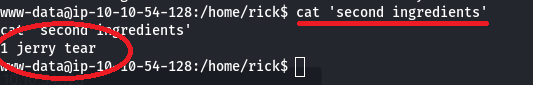

```json
{
    plataforma: TryHackMe,
    dificultad: easy,
    temas tratados: [http, netcat, comandos linux]
}
```

* * *

### [](#header-3)   1. Reconocimiento


Puertos abiertos:

```
- SSH: 22
- HTTP: 80
```


### [](#header-3)   2. Descubrimiento y escaneo

Vemos que el administrador se dejó ahí la contraseña: R1ckRul3s

Lanzo primero un escaneo rápido con nmap.

```
nmap --script=http-enum
```

Reporta que existe /login.php y /robots.txt


Yendo a /robots.txt, encuentro lo siguiente:


Pruebo a ver si puedo iniciar sesión con Wubbalubbadubdub como contraseña y así es.


Inspeccionando la página del panel de comandos veo que vuelve a haber un comentario, este acaba en ==, lo que me hace pensar que puede estar codificado en base64, ya que así es como se ve el padding. Tras pasarlo varias veces por un decodificador de base64 obtengo el siguiente resultado.


Un rabbit hole, efectivamente.

### [](#header-3)   3. Evaluación de vulnerabilidades

Si en el panel de comandos ejecuto ls obtengo:


Y al dirigirme a http://$IP/Sup3rS3cretPickl3Ingred.txt

Obtengo el primer ingrediente:

```
mr. meeseek hair
```


Con sudo -l veo que puedo ejecutar cualquier comando, así que trato de obtener una reverse shell.


Estamos dentro. 

### [](#header-3)   4. Explotación

Tras estabilizar la shell con:

```py
python3 -c 'import pty; pty.spawn("/bin/bash")'
```

Puedo buscar más ingredientes para la poción de Rick. 
Puedo a acceder a /home/rick y allí veo el segundo ingrediente.



Veo que hay un directorio /root, pero no puedo acceder si no soy root.

### [](#header-3)   5. Escalada

Como puedo ejecutar todos los comandos, pruebo sudo /bin/bash y da resultado. 
Ahora solo tengo que navegar a la carpeta /root y ya tengo el tercer ingrediente.


### [](#header-3)   6. Evaluación

Picklerick es una máquina en la que he podido ejecutar todos los comandos de Linux que he necesitado, lo que ha hecho muy fácil conseguir una reverse shell. 
He intentado usar netcat para subir linpeas.sh a la máquina, pero la escalada de privilegios era mucho más sencillo que eso.


