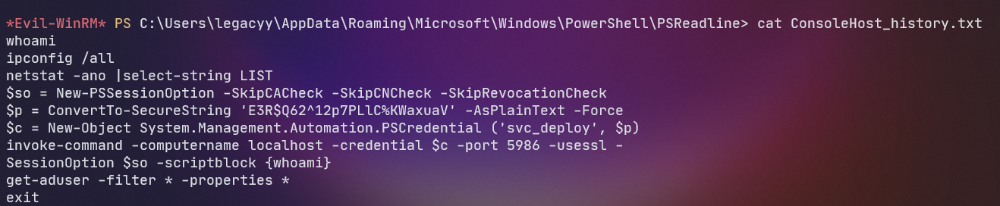
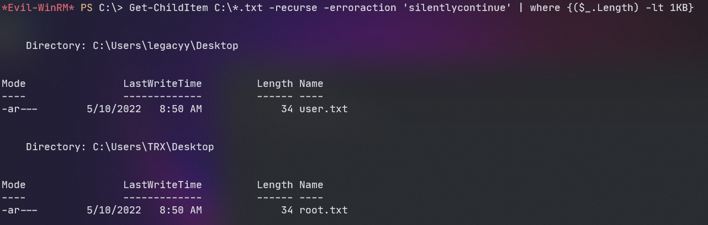

Jorge Marco Arráez

### [](#header-3)   1. Reconocimiento

```
nmap -n -Pn --min-rate 5000 -sCV 10.10.11.152
```

Puertos abiertos:

```
- 53: domain
- 88: kerberos-sec
- 135: msrpc
- 139: netbios-ssn
- 389: ldap
- 445: microsoft-ds
- 464: kpasswd5?
- 593: ncacn_http
- 636: tcpwrapped
- 3268: ldap
- 3269: tcpwrapped
```

### [](#header-3)   2. Descubrimiento y escaneo

Al ver abierto el puerto 445, me conecto con SMB para ver si hay algún fichero compartido a nivel de red.


Obtengo un fichero .zip protegido con contraseña.


En el directorio HelpDesk veo archivos relacionados con LDAP (Lightweight Directory Access Protocol).

### [](#header-3)   3. Evaluación de vulnerabilidades

El fichero .zip está protegido con contraseña, que puede ser vulnerada con fcrackzip. 

```
fcrackzip -v -D -u -p  /home/jorge/Descargas/rockyou.txt winrm_backup.zip
```

Al hacerlo, obtengo un fichero .pfx que también está protegido por contraseña. 

```
pfx2john legacyy_dev_auth.pfx > pfx.txt
john -w=rockyou.txt pfx.txt
password=thuglegacy
```

Consigo descifrar el .pfx, ahora solo queda extraer sus contenidos.

```
openssl pkcs12 -in legacyy_dev_auth.pfx  -nocerts -out clave.key

openssl rsa -in clave.key -out clavedecrypted.key
```
Obtengo un certificado y una clave RSA.


### [](#header-3)   4. Explotación

Con este certificado puedo conectarme a la máquina víctima usando evil-winrm.


Ya puedo obtener la flag de user.


Para terminar de ver que puedo hacer como usuario, hago una enumeración básica de Windows.


Puedo ver que usuarios existen en la máquina.

### [](#header-3)   5. Escalada

En un principio pensé en WinPEAS para escalar privilegios, pero Windows Defender está activado en la máquina víctima y detecta como malicioso la versión .exe y .ps1, al ejecutar la versión en .bat no consigo ser administrador, pero me reporta que hay un fichero interesante.


En él hay lo siguiente:



Ejecutando esos comandos puedo conectarme con las credenciales del usuario svc_deploy.
Además, veo a qué grupo pertenece cada usuario. Da la casualidad que svc_deploy pertenece al grupo "LAPS_Readers", lo que es realmente interesante. 


Ahora pruebo a conectarme como Administrator a la máquina.


Como la flag no está en el escritorio, voy a buscar ficheros de texto de menos de 1KB para agilizar la búsqueda:

```
Get-ChildItem C:\*.txt -recurse -erroraction 'silentlycontinue' | where {($_.Length) -lt 1KB}
```



Ya tengo la flag.


### [](#header-3)   6. Evaluación

Timelapse es la primera máquina de dificultad Easy que hago de HackTheBox. He tardado bastante en sacarla, pero al final ha merecido la pena. 

He aprendido mucho de LAPS y he aprendido a enumerar usuarios en Windows y a manejar la herramienta evil-winrm, así como john y fcrackzip. 

