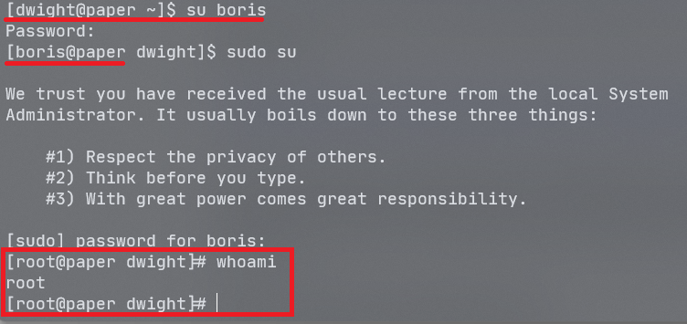

Jorge Marco Arráez

### [](#header-3)   1. Reconocimiento

```
nmap -sCV --min-rate 5000 -n -Pn -oN nmap/initial 10.10.11.143
```

Puertos abiertos:

```
- 22: SSH, version OpenSSH 8.0 (protocol 2.0)
- 80: HTTP, version Apache httpd 2.4.37 ((centos) OpenSSL/1.1.1k mod_fcgid/2.3.9)
- 443: SSL/HTTP, Apache httpd 2.4.37 ((centos) OpenSSL/1.1.1k mod_fcgid/2.3.9)
```


### [](#header-3)   2. Descubrimiento y escaneo


Esta página parece la que viene por defecto en un servidor web. He mirado a ver si podía listar algún recurso del servidor buscando por la ruta relativa en la barra de búsquedas, pero no he conseguido nada. También he usado gobuster para ver si había directorios, pero tampoco.

Analizando los resultado que ofrece WhatWeb, veo que se está aplicando virtual hosting. Editando el archivo /etc/hosts ya me puedo conectar a la web. 


Explorando los posts de Prisonmike, veo un comentario interesante del usuario Nick:


### [](#header-3)   3. Evaluación de vulnerabilidades

Busco por la página a ver si hay algún post interesante, pero no encuentro información relevante. También reviso el código HTML de toda la web, pero no veo ningún comentario que me interese.

Si busco vulnerabilidades de la versión de WordPress que se está usando, encuentro lo siguiente: 


Al añadir "?static=1" a la búsqueda accedo a un borrador donde se revela la existencia de otra página: un chat para los empleados de la oficina.


Me registro y veo que hay un bot: "Recyclops", que puede ejecutar los comando cat y ls.


### [](#header-3)   4. Explotación

En un principio pensé que podría hacer una Command OS Injection, pero no es el caso.

Abusando de ls y cat, consigo ver las variables de entorno que tiene el usuario Dwight:


```
export ROCKETCHAT_USER=recyclops
export ROCKETCHAT_PASSWORD=Queenofblad3s!23
```

Con estas credenciales me intento conectar como Dwight.


Ya estamos dentro.

### [](#header-3)   5. Escalada

En mi ordenador abro el puerto 8000 para conectarme a él desde la máquina víctima, con el propósito de hacer wget al fichero linpeas.sh:


Al ejecutarlo no consigo hacerme administrador, pero me reporta una vulnerabilidad bastante interesante, recogida en el siguiente CVE:

```
CVE-2021-3560
```

El exploit consiste en ejecutar comandos para crear un usuario con permisos root. Estos requieren permisos de super-usuario pero terminándolos a los pocos milisegundos se consigue que la máquina los acepte y los ejecute.

Haciendo uso de ella, creo un usuario con permisos root y establezco su contraseña. 



Siendo administrador, solo queda ir a /root y conseguir la flag.


### [](#header-3)   6. Evaluación

Paper es la segunda máquina de dificultad Easy que hago de HackTheBox. Ha sido muy entretenido, no solo por la escalada, sino también la temática y todos los gags que había en el camino.

Una máquina bastante rápida, me ha llevado alrededor de 8 horas.

Con esta máquina he aprendido vulnerabilidades bastante específicas de WordPress y de Unix.

